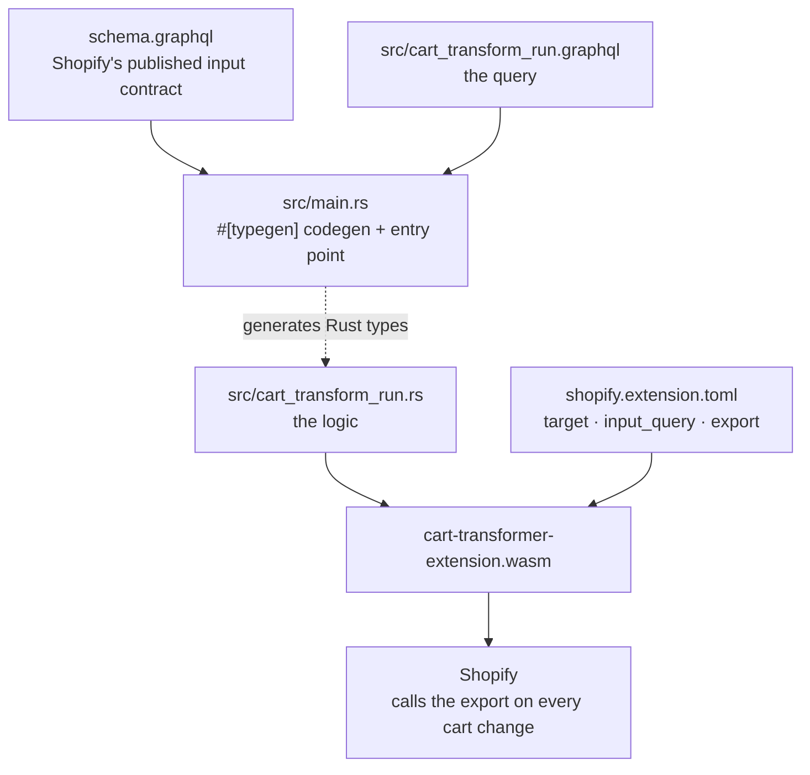

# lucrative-outsource-app

A **learning** Shopify app. The point of this repo is to practise app development end to end:
scaffolding, extensions, Shopify Functions, and the store plumbing that actually makes a feature go
live.

Built from the [extension-only app template](https://github.com/Shopify/shopify-app-template-extension-only)
(Preact + Vite + App Bridge + Direct API access — no server), then grown from there.

The first real feature is the **bundle cart transform function** in
[`extensions/cart-transformer-extension`](./extensions/cart-transformer-extension): a bundle product
is automatically expanded into its component variants in the cart and at checkout, with optional
per-component pricing.

## What's in here

| Extension | Type | Target | What it does |
| --- | --- | --- | --- |
| [`app-home`](./extensions/app-home) | UI extension | `admin.app.home.render` | The app's admin landing page plus a working FAQ CRUD feature. Preact + Polaris web components; calls the Admin GraphQL API directly from the browser. |
| [`app-tools`](./extensions/app-tools) | UI extension | `admin.app.tools.data` | Tool/instruction payload driven by `tools.json` and `instructions.md`. |
| [`cart-transformer-extension`](./extensions/cart-transformer-extension) | Function (Rust) | `cart.transform.run` | Expands a bundle product into its component variants. |

Shared, framework-agnostic code lives in [`shared/`](./shared).

## Data model

Two storage patterns are used, both without a database:

- **Metaobjects + metafields** — the FAQ feature in `app-home`. `shopify.app.toml` defines an
  `app.faq` metaobject (`question`, `answer`, `show_on_faq_page`) and an `app.faq` **product**
  metafield of type `metaobject_reference<$app:faq>` with `merchant_read_write` access.
  [`shared/models/faq.ts`](./shared/models/faq.ts) is the shared model that lists, creates, updates
  and deletes them through the Admin GraphQL API via the direct-access endpoint
  (`shopify:admin/api/2026-07/graphql.json`).
- **A plain shop metafield** — the cart transform's promo config (see below). Simpler, and read
  directly by the function rather than by the UI.

Both are synced to Shopify when you run `shopify app dev` or `shopify app deploy`.

## Prerequisites

- **Node.js 22+**
- **Shopify CLI**: `npm install -g @shopify/cli@latest`
- **Rust + the WASM target** — only needed for the cart transform function:

  ```shell
  curl --proto '=https' --tlsv1.2 -sSf https://sh.rustup.rs | sh -s -- -y --profile minimal
  source "$HOME/.cargo/env"
  rustup target add wasm32-unknown-unknown
  ```

  Verify with `cargo --version`. **Open a new terminal after installing** — see Troubleshooting.
- A **development store** to install the app on.

> `shopify app dev` shells out to `cargo`, so `cargo` must be on the `PATH` of the terminal you run
> it from.

## Getting started

```shell
npm install        # installs workspace deps (extensions/*), including vitest
shopify app dev
```

`shopify app dev` builds every extension, pushes config and functions, and prints two URLs:

- a **preview URL** for the embedded app
- a **GraphiQL URL (Admin API)** — an already-authenticated console for the dev store. Most of the
  manual steps below are done here.

## The cart transform: bundle expansion

A **bundle product** is a normal product variant that stands in for a group of other variants. When a
buyer adds one, the function emits a `lineExpand` operation that replaces the line with its
components.

Components are defined per product, in the app-owned `json` metafield `$app` / `bundle_components`.

### Config shape

```json
{
  "components": [
    { "id": "gid://shopify/ProductVariant/111", "quantity": 2, "price": "24.99" },
    { "id": "gid://shopify/ProductVariant/222", "quantity": 1, "price": "9.95" }
  ]
}
```

| Field | Meaning |
| --- | --- |
| `components[].id` | Variant GID of a component. Required. |
| `components[].quantity` | How many of that variant **one bundle unit** contains. |
| `components[].price` | Optional per-unit price, in the **shop's** currency. |

### How the quantity multiplies — read this before debugging

`components` is the recipe for **one** unit of the bundle. Shopify multiplies every quantity by the
cart line's quantity, so a line of 3 bundles yields `3 × 2` and `3 × 1` of the components above.

That is exactly what makes this work for bundles — and it is why `lineExpand` is the **wrong tool for
cart-wide promotions**: a rule like "1 free per 3 units" is not a whole number per unit, so it cannot
be expressed as a component quantity at all.

### Pricing

Pricing is all-or-nothing, because Shopify rejects an expansion that mixes priced and unpriced items:

- **every** component has a `price` → all are priced, converted from the shop's currency using
  `presentmentCurrencyRate`;
- **any** component omits `price` → none are priced, and the bundle product's own price applies.

A price that fails to parse also falls back to "no pricing".

### Design note: why the config lives on the product

Shopify documents a fuller platform bundle convention — `component_reference` and
`component_quantities` metafields on the bundle **variant**, plus `component_parents` on each
component — which unlocks sellable-quantity/oversell protection, Liquid `item_components`, Storefront
API bundle support and `linesMerge`.

**This app deliberately does not use it.** A bundle here is a plain **product** carrying a list of
**fixed variant + quantity** pairs: no buyer choice, no options, one readable config location. The
trade-offs are:

- every variant of the bundle product is treated as a bundle, so components must come from a
  **different product**;
- no Storefront API or partner-fulfilment-app interoperability;
- no automatic oversell protection derived from component inventory.

If you ever need those, the migration is mechanical: move the config to the bundle *variant*, rename
the keys to `component_reference` + `component_quantities`, and write `component_parents` on each
component.

## How the extension is wired

A Shopify Function is not a service. It's a WASM module Shopify loads and calls — nothing runs
continuously, and there is no server to deploy. Five files define the whole thing:



| File | Role |
| --- | --- |
| `shopify.extension.toml` | Manifest — the target, the input query, the export name, the build command |
| `schema.graphql` | The input contract Shopify publishes for `cart.transform.run` |
| `src/cart_transform_run.graphql` | The query whose result *is* the function's entire input |
| `src/main.rs` | Codegen + entry point. **No business logic lives here.** |
| `src/cart_transform_run.rs` | The logic, the config structs, the unit tests |

### The linchpin

```toml
export = "cart_transform_run"
```

That string **must match the Rust function name**. It's how Shopify knows what to call — and why
`main()` in `main.rs` simply aborts: the real entry point is the export, wired by name.

### Two things that surprise people

**Shopify is condition-blind.** It calls the function on *every* cart change with the *entire cart* —
no filtering, no awareness of bundles. Deciding which lines qualify is the function's job:

```rust
match variant.product().bundle_components() {
    Some(metafield) => metafield.json_value(),
    None => continue,   // ← this IS the "condition"
}
```

**The function describes an outcome; it doesn't issue commands.** It returns a description of the
desired end state (`operations`), and Shopify decides whether to accept it. That division of labour
is why a green local test suite can still be rejected server-side — describing intent and validating
intent are different jobs, done by different software.

### `main.rs` is almost entirely codegen

```rust
#[typegen("schema.graphql")]
pub mod schema {
    #[query("src/cart_transform_run.graphql", custom_scalar_overrides = { … })]
    pub mod cart_transform_run {}
}
```

`#[typegen]` reads `schema.graphql` and the query and **generates the Rust types at compile time** —
`schema::Operation`, `schema::ExpandedItem` and friends were never written by hand. It is also why
editing the query requires a rebuild, not just a re-deploy.

## Going live on a store

Three things must all be true, and each one fails *silently* on its own.

**1. Scope.** `shopify.app.toml` must include `write_cart_transforms`:

```toml
[access_scopes]
scopes = "write_cart_transforms,write_products"
```

**2. Config.** Write the metafield onto the **bundle product** from the app's GraphiQL console (`$app`
resolves to *the calling app*, so this must be done as the app):

```graphql
mutation {
  metafieldsSet(metafields: [{
    ownerId: "gid://shopify/Product/<bundle-product-id>"
    namespace: "$app"
    key: "bundle_components"
    type: "json"
    value: "{\"components\":[{\"id\":\"gid://shopify/ProductVariant/111\",\"quantity\":2,\"price\":\"24.99\"}]}"
  }]) { metafields { id } userErrors { field message } }
}
```

`ownerId` is the **bundle product's** GID — not the shop, and not the store handle. Get it with
`{ product(id: "...") { id } }` or from the product's admin URL.

To let the merchant see and edit this in the admin, declare it in `shopify.app.toml` as a product
metafield (the same pattern as the FAQ metafield already in there).

**3. Registration.** A cart transform does nothing until it is registered — this is the step that makes
a deployed function look completely inert:

```graphql
mutation {
  cartTransformCreate(functionHandle: "cart-transformer-extension", blockOnFailure: true) {
    cartTransform { id functionId }
    userErrors { field message }
  }
}
```

`blockOnFailure: true` makes function errors surface loudly instead of degrading silently — good while
iterating. Flip it to `false` for production behaviour. Undo with `cartTransformDelete(id: "<id>")`.
Only one cart transform per app per store.

## Building and testing

### Local

```shell
# Build every extension locally without pushing anything to the store
npm run build

# Rust unit tests: expansion, pricing, guards (no WASM involved)
cd extensions/cart-transformer-extension && cargo test

# Integration: compiles the WASM and diffs its real output against tests/fixtures/*.json
cd extensions/cart-transformer-extension && ../../node_modules/.bin/vitest run

# Run the function against a hand-written input — no store, no deploy
cd extensions/cart-transformer-extension && shopify app function run -e cart_transform_run -i input.json
```

All of these work offline and none of them touch your store. That matters, because the store is the
only place the *rest* of the pipeline is exercised.

### Verifying on a store

After the "going live" steps above:

1. Open the **bundle product's** variant on the storefront — it must be published and in stock — and
   add **1** to the cart.
2. The cart line should split into its components, nested beneath the bundle title.
3. Raise the quantity to **2**. Every component should read `× 2`.

Expected numbers for the fixture-style config (a bundle priced $885.95 expanding into two components):

| Quantity | Components | Line total |
| --- | --- | --- |
| 1 | ×1, ×1 | $885.95 |
| 2 | ×2, ×2 | $1,771.90 |

Those totals assume **no `price` on any component**, so the bundle product's own price applies. If you
price every component, the total becomes the sum of the parts instead.

### Reading the outcome

The three possible outcomes are only distinguishable because the registration uses
`blockOnFailure: true`:

| What you see | What it means |
| --- | --- |
| The line splits into components | Working. |
| An error on the cart | The function ran and Shopify **rejected** its operation — a real bug. |
| Nothing at all | The function isn't running: stale WASM, unregistered transform, or no readable metafield on that product. |

That third case is the time-waster, because it is *also* exactly what a correctly working function
does when a product has no bundle config. Silence is ambiguous by nature — which is the whole reason
to register with `blockOnFailure: true` while iterating.

### Adding a fixture

Fixtures are auto-discovered from `tests/fixtures/*.json`, so dropping a file in adds a test. Each
carries both the input and the expected output:

```json
{ "payload": { "export": "cart_transform_run", "target": "cart.transform.run", "input": { … }, "output": { … } } }
```

> The integration test compares output **exactly**. Change what the function emits and the fixtures
> must change with it — otherwise you get a failure that looks like a bug but is a stale expectation.
>
> The test harness also validates the input fixture against the query, so an input field that the
> query doesn't select is an error. Selections removed from the query must be removed from fixtures too.

## Troubleshooting

**`shopify app dev` → `Failed to build function` / `spawn cargo ENOENT`**
The terminal predates the Rust install. Open a new terminal, or `source "$HOME/.cargo/env"`. Check with
`command -v cargo`.

**`npx vitest` sits there doing nothing**
Dependencies are not installed. Run `npm install` at the repo root first.

**The cart looks completely normal / nothing happens**
Usually a "going live" step above is missing, or the metafield is absent/malformed. A bad config reads
as zero components, which is indistinguishable from the function not running. Also confirm the
metafield is on the **bundle product** and that the buyer's cart line is that product's variant.

**`{"errors":"Cart Error"}` when changing the cart**
The function ran and Shopify rejected its operation. Check the
[`lineExpand` invalid scenarios](https://shopify.dev/docs/api/functions/latest/cart-transform) — most
commonly an expansion that mixes priced and unpriced items. This is enforced *server-side*, so a green
local test suite does not rule it out.

**`Owner does not exist` on `metafieldsSet`**
`ownerId` must be a real resource GID in numeric form (`gid://shopify/Product/123`,
`gid://shopify/Shop/82282873055`) — a `.myshopify.com` handle is not an ID.

## Conventions

- Write Shopify API and platform code with the
  [Shopify AI Toolkit](https://shopify.dev/docs/apps/build/ai-toolkit); see [AGENTS.md](./AGENTS.md).
- Run `npm install` at the repo root — extensions are npm workspaces.
- Never commit secrets. The GraphiQL URL printed by `shopify app dev` contains a session key.

## Resources

- [Shopify app getting started](https://shopify.dev/docs/apps/getting-started)
- [Direct API access](https://shopify.dev/docs/api/app-home#direct-api-access)
- [Shopify Functions](https://shopify.dev/docs/api/functions)
- [Cart Transform function API](https://shopify.dev/docs/api/functions/latest/cart-transform)
- [Shopify CLI](https://shopify.dev/docs/apps/tools/cli)
- [Polaris web components](https://shopify.dev/docs/api/app-home/web-components)
- [App Bridge](https://shopify.dev/docs/api/app-bridge)
- [Metaobjects](https://shopify.dev/docs/apps/custom-data/metaobjects)
